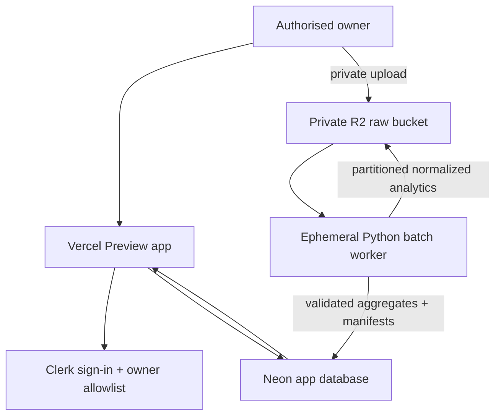

# Phase 0 Architecture Decision Record

Status: **Proposed for Gate A review**  
Date: 22 July 2026  
Scope: private single-user Preview architecture only; Production remains disabled.

## 1. Decision summary

DNA Racing Intelligence will use a deliberately split application and analytics architecture:

- **Next.js App Router with strict TypeScript** for the private responsive web application;
- **Tailwind CSS with accessible native/component primitives** for a consistent dashboard UI;
- **Clerk** for single-user authentication, with an explicit authorised-user ID allowlist in addition to successful sign-in;
- **Neon PostgreSQL** for application state, import manifests, user configuration, durable aggregates, reconciliation records and the economic ledger;
- **Cloudflare R2 Standard storage** for encrypted private raw uploads and partitioned analytical files;
- **Python with Polars and DuckDB** in an ephemeral batch worker for import validation, normalization, chronological features and aggregate refreshes;
- **GitHub Actions** as the initial low-frequency hosted batch runner, with manual dispatch fallback and no raw-data artifacts;
- **Vercel Preview deployments only** during development; Production builds and requests fail closed.

This separates confidential large files and batch computation from the request path. Normal pages read compact, indexed PostgreSQL aggregates rather than scanning multi-million-row race history.

## 2. Repository and supplied-data findings

The repository contained governance and specification documents only when Phase 0 began. No application package, route, CI workflow, deployment configuration or ignore rules existed.

Private supplied exports were inspected only in the remote working environment. They were not copied into the repository and no source rows are recorded here. The inspection confirmed the architectural need to handle:

- approximately 2.5 million race-entry rows and roughly 695,000 events, consistent with the master specification;
- sequential source files that can overlap and therefore require stable natural-key deduplication;
- legacy text encodings as well as UTF-8-compatible content;
- Boolean spelling/casing variation;
- Unix-second event timestamps;
- vault files that may require identity resolution rather than unsafe name-only joins; and
- a legacy file/column name that says `Bike`/`bikeid` even though the file is the cross-mode **Core Details** source.

The source alias will be preserved in raw provenance while normalized application terminology uses `core_id` and **Core Details**. The obsolete race-class column remains provenance-only and is excluded from analytical features.

## 3. System topology

No browser receives R2 credentials. Uploads use short-lived, content-length-limited signed requests. Download links are short lived and owner-authorised. Raw objects are private, never served from a public `r2.dev` endpoint and never stored as GitHub Actions artifacts.

## 4. Application boundaries

The application uses route groups and domain modules with the following separation:

| Boundary                 | Responsibility                                                                               |
| ------------------------ | -------------------------------------------------------------------------------------------- |
| `app/` and `components/` | Private pages, accessibility, responsive presentation and explicit snapshot language         |
| `domain/`                | Deterministic confirmed game rules, star boundaries, freshness and ledger invariants         |
| import service           | File detection, encoding/schema validation, provenance, quarantine and idempotent acceptance |
| analytics worker         | Polars transforms, DuckDB/Parquet queries, chronological feature generation and aggregates   |
| repository layer         | Parameterised Neon access, transactions and owner scoping                                    |
| recommendation layer     | Later phase, only after chronological validation and Gate C                                  |

The Phase 0 UI deliberately contains no fabricated recommendations, rankings, balances or profit figures.

## 5. Private single-user access

The accepted design is defence in depth:

1. Vercel Preview deployment protection must be enabled before `ENABLE_PHASE0_REVIEW=true` is set.
2. Clerk authenticates the user in Phase 1.
3. Every private request must also match one server-side `AUTHORIZED_CLERK_USER_ID`.
4. Missing authentication configuration denies access; it never creates an anonymous mode.
5. PostgreSQL queries remain scoped to the single internal owner record even though there is currently one user.
6. Robots metadata, `robots.txt` and response headers deny indexing.

The scaffold currently implements the deployment boundary, route structure and fail-closed defaults. Clerk integration is an account/secret action that must occur after Gate A acceptance. It is not bypassed with a public demo mode.

## 6. Production and Preview controls

- A Vercel Production build exits unsuccessfully unless `ALLOW_PRODUCTION_DEPLOYMENT=true` is explicitly supplied after Gate F approval.
- Runtime access also returns a non-indexable 404 for Production while approval is absent.
- A Preview returns the same 404 until `ENABLE_PHASE0_REVIEW=true` is set in the protected Preview environment.
- CI and the remote development environment may build without either Vercel flag.
- No custom domain, Production database, Production bucket or Production secret is part of Phase 0.

Repository configuration is an additional control, not a substitute for confirming Vercel project settings before connection.

## 7. Import and storage design

### 7.1 Raw objects

Each upload receives an immutable object key containing a generated batch ID rather than a user-controlled path. The import manifest stores:

- original filename as private metadata;
- SHA-256 checksum;
- detected source type and schema version;
- upload/import timestamps;
- source byte and row counts;
- minimum and maximum accepted event timestamps;
- accepted, rejected and warning counts;
- object key, processing status and aggregate-refresh status.

Uploads enter a quarantine prefix. Only a validated batch is promoted logically to accepted status. A failed batch remains isolated and can be deleted under the documented retention policy.

### 7.2 Encoding and schema handling

The importer checks byte-order marks and attempts strict UTF-8 first. Legacy single-byte encodings are detected and decoded explicitly with a warning. Invalid byte sequences, malformed rows or ambiguous schemas are quarantined; they are never silently replaced.

Source-specific aliases are versioned. In particular, the historical Core Details export may use a Bike-labelled filename and `bikeid`; normalization maps this to `core_id` while preserving the raw source name/value.

### 7.3 Deduplication and rollback

The expected race-entry natural key is `event_id + token/core_id`. Accepted analytical partitions and economic derivations add source/version and transaction-type keys as appropriate. A repeated or overlapping export can update provenance and freshness without creating duplicate race, star or economic evidence.

Acceptance is transactional at manifest level. New partitions and aggregates are written to versioned locations, validated, then atomically made current. Rollback repoints the active dataset version and reverses only records derived exclusively from the rejected batch; prior accepted facts remain intact.

### 7.4 Serving multi-million-row history

The application does not synchronously scan raw CSV or full Parquet history during ordinary page requests. Batch jobs produce:

- core × mode × exact-distance time/speed summaries;
- historical benchmark distributions;
- event-level star validation results;
- core star profiles with explicit denominators;
- chronological field-quality features;
- lineage adjacency and aggregate tables;
- freshness/source-coverage state;
- economic ledger derivations and reconciliation candidates; and
- bounded drill-down records needed by the UI.

Raw and normalized partitioned analytical history remains in R2 for audit and recomputation. Neon contains manifests, user state, indexed aggregates and bounded operational detail. This keeps the initial database small and predictable while preserving the ability to rebuild.

## 8. Gold and Blue star model

Normalized race-entry facts retain:

- nullable `gold_star` and `blue_star`;
- raw source values and source-column provenance;
- `gold_star_eligible = gate_count > 3`;
- `star_data_status` distinguishing complete, partial, missing and invalid;
- batch and source-row references; and
- anomaly codes without rewriting anomalous source values.

Event-level validation records gate count, eligibility, assignment counts, assigned core IDs, same-core-both state and warnings. More than one Gold or Blue assignment is surfaced. A source Gold assignment at three gates or fewer is retained and flagged.

Precomputed core profiles keep distinct denominators for:

1. all races with valid star data;
2. Gold-eligible races; and
3. races where the relevant star was actually assigned to someone.

One-, two- and three-gate races cannot become negative Gold evidence.

## 9. Chronological field quality and leakage prevention

All predictive feature tables have an `as_of_event_time` and source-dataset version. For an event at time `T`, opponent and lineage features are computed only from facts with event time strictly earlier than `T`. Processing is ordered by event timestamp with deterministic tie handling and as-of joins.

The current event's time, finish, payout and star conversion outcome are unavailable to its pre-race field-quality feature. Later events cannot enter through current aggregate tables because training extracts read versioned chronological features rather than today's core summary.

Post-race Gold top-three and Blue win conversion are diagnostic tables with a separate namespace and cannot be joined into pre-race features without an explicit test failure. Chronological train/validation/test splits and cutoff assertions are mandatory before Gate C.

## 10. Open Race two-stage model

Stage A accepts manually visible non-star race parameters and opponent IDs. Its input contract contains no current-race Gold or Blue field. Imported historical star profiles can be supporting prior evidence.

Stage B can begin only after the user confirms the field is locked and about to run. A manual observation uses a separate `manual_pre_run_star_observation` source with reconciliation status. It is observation-only, cannot produce a replacement-core recommendation and remains excluded from permanent aggregates until an authoritative Race Merge event matches it.

Matching prefers event ID; a cautious composite match is reviewable. Exact matches reconcile idempotently, mismatches enter review and unresolved observations remain excluded. Gold is not applicable when gate count is three or fewer.

## 11. Freshness and snapshot language

Each source state stores import completion time, latest accepted event/snapshot time and aggregate refresh completion time. The UI always separates:

- **Data current through**;
- **Last imported**;
- calculated data age; and
- current, ageing, stale or unknown state.

Initial configurable thresholds are 0–3 days current, 4–7 days ageing and more than 7 days stale. These labels describe imported history only. UI copy and tests prohibit describing imported races, opponents, stars, vault records, arena listings or tournaments as live.

## 12. Economic ledger

Neon stores an immutable-source/auditable-classification ledger. Each asset has an identifier, display code and scale. Transactions store signed atomic units as exact PostgreSQL `NUMERIC(78,0)` (or another reviewed exact integer representation) rather than binary floating point. Original asset and amount are never overwritten by a conversion.

Separate records cover transaction allocation, classification, duplicate/exclusion status, reversal, manual correction and reconciliation. Race-derived entry fee and payout transactions use the accepted race-entry key plus transaction type, preventing cumulative-import duplication.

Default reports:

- group each currency/asset independently;
- keep BGC as non-cash in-game credit;
- exclude deposits, withdrawals, opening balances and internal transfers from operating P/L;
- keep vault-level prizes unallocated where appropriate;
- report proceeds without invented gain/loss when cost basis is missing; and
- exclude unsold-core estimates from realised P/L.

Any conversion is a separate dated record with rate source and actual/estimated status. The system never requests or stores crypto private keys, seed phrases or signing credentials and never initiates wallet or game transactions.

## 13. Cost envelope as at 22 July 2026

Prices and limits can change and must be rechecked before Gate B or any paid activation.

| Service                                                        | Initial expectation                                                                                                                                                                      | Likely paid trigger                                                                                                                                         |
| -------------------------------------------------------------- | ---------------------------------------------------------------------------------------------------------------------------------------------------------------------------------------- | ----------------------------------------------------------------------------------------------------------------------------------------------------------- |
| [Vercel](https://vercel.com/pricing)                           | Hobby can support personal Preview work within usage caps. Current listed included usage includes 1M edge requests, 4 active CPU hours and 360 GB-hours of provisioned memory per month. | Pro is listed at US$20 per developer seat/month with included usage credit when commercial or higher-limit use is required. No upgrade is approved.         |
| [Clerk](https://clerk.com/pricing)                             | Hobby is free and supports up to 50,000 monthly retained users per app; this product has one user.                                                                                       | Pro is listed at US$25/month or US$20/month billed annually. No upgrade is expected for single-user use.                                                    |
| [Neon](https://neon.com/pricing)                               | Free includes 100 CU-hours per project/month and scales compute to zero. Store compact application state and aggregates first.                                                           | Storage/compute growth from detailed operational data may require a paid plan; confirm the current dashboard quote before Gate B rather than assume a cost. |
| [Cloudflare R2](https://developers.cloudflare.com/r2/pricing/) | Standard storage includes 10 GB-month, 1M Class A and 10M Class B operations monthly with free egress. The supplied raw data is well below this storage allowance.                       | Beyond free usage, Standard storage is US$0.015/GB-month, Class A US$4.50/million and Class B US$0.36/million.                                              |
| GitHub Actions                                                 | Use the repository owner's existing included private-repository minutes for low-frequency imports, with a timeout and manual fallback.                                                   | Stop before paid overage; migrate the worker only after a measured workload and owner approval.                                                             |

Expected Phase 0 cost is **US$0**. The initial operational target is also US$0 while free-tier limits suffice. Paid infrastructure, recurring billing and Production remain review-gated.

## 14. Alternatives considered

- **Store all raw rows in Neon:** simpler querying, but increases free-tier pressure and encourages request-time coupling to the full history. Rejected for initial delivery.
- **Process large CSVs in Vercel request functions:** creates timeout/memory risk and blocks user requests. Rejected.
- **Commit sanitized or private exports to Git:** conflicts with privacy controls and repository history permanence. Rejected.
- **Public demo mode:** conflicts with private single-user boundaries. Rejected.
- **Combine all assets into a reporting currency by default:** would make incomplete conversions look authoritative. Rejected.

## 15. Gate A decision

Implementation must not proceed beyond the Phase 0 scaffold until the owner accepts or amends:

- Clerk plus owner-ID allowlisting;
- Neon aggregate/application storage;
- private R2 raw/analytical storage;
- hosted Python batch processing;
- Preview-only fail-closed delivery;
- star, Open Race, freshness, no-leakage and ledger representations; and
- the cost envelope.
