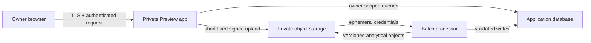

# Privacy, Threat Model and Data Flow

Status: **Proposed for Gate A review**  
Date: 22 July 2026

## 1. Protected assets

- raw Race Merge, Core Details, Current Vault and Current Arena exports;
- normalized and derived race, lineage, star and recommendation data;
- economic transactions, wallet/account labels and external references;
- authentication sessions, provider secrets and database/storage credentials;
- import manifests, reconciliation records and analytical model outputs.

The platform does **not** request or store crypto private keys, seed phrases, signing credentials or wallet-custody secrets. It does not initiate blockchain, game, marketplace, race-entry, breeding, sale or burn transactions.

## 2. Trust boundaries

Trust is not inferred from possession of a Preview URL. Deployment protection, application authentication and server-side owner allowlisting are separate controls.

## 3. Threats and controls

| Threat                                      | Consequence                                                | Required controls                                                                                                               |
| ------------------------------------------- | ---------------------------------------------------------- | ------------------------------------------------------------------------------------------------------------------------------- |
| Unauthorised Preview discovery              | Exposure of private UI or data                             | Preview disabled by default, deployment protection, Clerk sign-in, owner-ID allowlist, non-indexing headers                     |
| Accidental Production deployment            | Public or unintended durable environment                   | Production build guard, runtime 404, no Production secrets/domain/database, Gate F approval required                            |
| Raw upload made public                      | Full vault/race disclosure                                 | Private R2 bucket, block public access, no `r2.dev`, short-lived signed URLs, random object keys                                |
| Malicious filename or file-type confusion   | Object overwrite, wrong parser or code execution attempt   | Server-generated object keys, header-based detection, extension not trusted, strict schema/size limits, no execution of uploads |
| CSV formula or parser abuse                 | Data corruption or unsafe later export                     | Treat every cell as data, strict streaming parser, quote outputs, quarantine malformed rows, no spreadsheet execution           |
| Legacy/invalid encoding                     | Silent name or identifier corruption                       | Strict UTF-8 first, explicit detected fallback, warning/provenance, reject ambiguous decoding                                   |
| Duplicate/overlapping imports               | Double-counted races, stars or payouts                     | Checksums, stable natural keys, versioned acceptance, idempotent economic suffix keys, aggregate rebuild tests                  |
| Name-only identity join                     | Wrong vault/core attribution                               | Durable source IDs are authoritative, normalized-name matches are proposed only, ambiguous/unmatched rows enter review          |
| Outcome/future leakage                      | Inflated analytical performance and unsafe recommendations | Event-time cutoffs, as-of features, diagnostic/predictive table separation, chronological holdouts and assertions               |
| Star-state collapse                         | False negative Gold evidence                               | Nullable normalized values, raw provenance, explicit eligibility and assignment-opportunity denominators                        |
| Post-lock Open Race misuse                  | Suggestion that a committed core can be switched           | Two-stage state machine, Stage B observation-only, no replacement output, separate reconciliation source                        |
| Economic floating-point or conversion error | Incorrect P/L                                              | Exact atomic/minor units, per-asset totals, dated explicit conversions only, BGC separate                                       |
| Transfer classified as income               | Overstated operating result                                | Non-performance movement categories excluded by domain rule and tested                                                          |
| Secret or private row in logs               | Durable disclosure to providers                            | Structured counts/error codes only, redaction, no raw rows, wallet references or credentials in logs                            |
| Compromised batch dependency                | Source data or credentials exfiltration                    | Pinned lockfiles/images, least-privilege ephemeral credentials, dependency review, restricted job permissions                   |
| Excessive retention                         | Larger breach impact                                       | Documented raw/quarantine retention, owner deletion workflow, versioned purge audit, no unnecessary artifacts                   |
| Denial of service or cost spike             | Availability loss or unexpected billing                    | Upload limits, rate limits, job timeouts/concurrency, free-tier monitoring and paid-usage stop gate                             |

## 4. Least-privilege access

- The browser receives only an authorised signed operation for one object, never an R2 access key.
- The web application may create upload manifests and read aggregates but should not hold destructive bucket-wide credentials.
- The batch worker receives time-bounded access to pending objects and a database role limited to import/aggregate tables.
- CI validation receives no data-service secrets.
- Logs expose import IDs, counts, checksums truncated for display and warning codes, not source rows.
- External transaction hashes and full wallet addresses are optional and redacted by default; wallet/account labels are sufficient for normal use.

## 5. Retention and deletion proposal

- Failed/quarantined uploads: delete after 7 days once the user has reviewed the failure, unless placed on hold.
- Accepted raw uploads: retain while needed for reproducibility and rollback; allow owner-initiated deletion only after a replacement snapshot and derived-data impact review.
- Normalized analytical partitions: versioned, with at least the current and previous accepted version retained for rollback.
- Manual economic and correction records: preserve audit history; use reversals/exclusions rather than silent deletion.
- Account deletion: revoke sessions and secrets, delete raw/derived objects, then delete database records under a verified owner workflow.

Exact retention periods must be confirmed before Gate B. Deleting accepted source data is always reviewable and never an automatic cleanup side effect.

## 6. Incident and recovery expectations

1. Disable Preview access and revoke affected credentials.
2. Preserve non-sensitive audit metadata without copying raw source content.
3. Identify affected object, batch and database versions.
4. Rotate Clerk, Neon, R2 and deployment secrets as applicable.
5. Restore the last accepted manifest/aggregate version.
6. Reprocess from retained immutable raw data where safe.
7. Record the incident and corrective action without placing private values in Git.

## 7. Gate A and Gate B checks

Gate A must accept the provider choices, fail-closed design, data flow, cost envelope and the categorical exclusion of signing secrets.

Before Gate B, verify configured provider controls with synthetic data only:

- one authorised user and denied non-owner access;
- private bucket with public access disabled;
- least-privilege service credentials;
- Preview-only secrets and database branch;
- retention/deletion and rollback behaviour;
- redacted logs;
- star-state, freshness and economic deduplication proofs; and
- estimated storage/processing cost for the full upload set.
